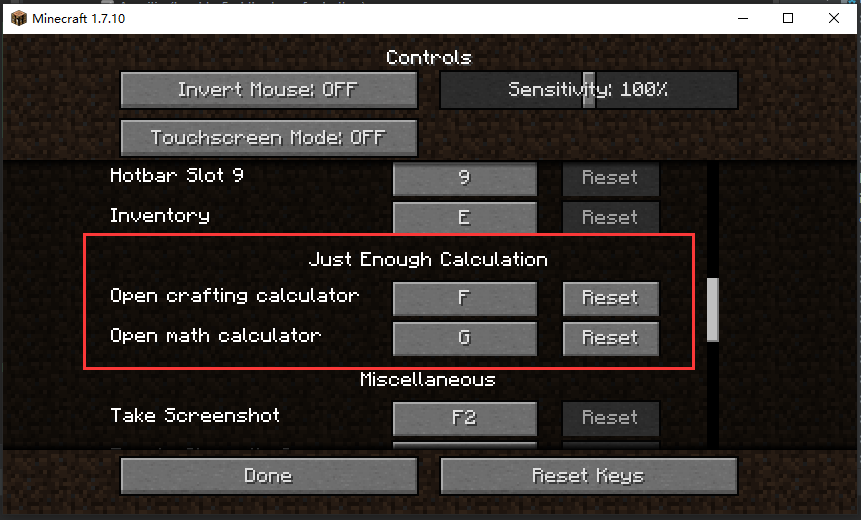
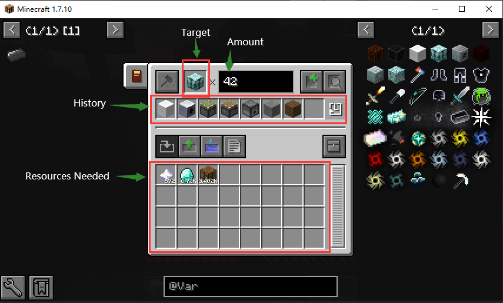

[![][1]][3] [![][2]][3] [![][4]][5]

# Just Enough Calculation Mod

Hey, this is a small add-on to **NEI** (Not Enough Items), in
order to help you calculate the amount of resources to craft a specific amount of item. .

This might be a little confusing, here's an example:

- you want to know how many wood logs do you need to craft 40 stairs, simply load the recipe you want to use, and it will
  tell you 13 logs should be enough, that's all.

This mod is focused on calculation, so you might find it powerful and high performance in some complicated cases. Have fun!

---

查看所有的 Release 文件, 描述或者视频, 请查看 [release 页面](https://minecraft.curseforge.com/projects/just-enough-calculation).

## 功能

- **仅客户端（大概），无默认按键绑定， 请根据个人喜好设置**
- 支持 [NEI-GTNH-2.1](https://github.com/GTNewHorizons/NotEnoughItems) 的催化剂（不消耗的合成参与者，如工作台，各种机器之类的）
- 合成表的输入、输出和催化剂 无数量限制
- 数学计算器
- 可以从 NEI 合成表 gui 页面直接获取合成表 (`shift` + 单击 `?` 按钮)
  - [x] 原生MC
  - [x] gregtech
  - [x] Forestry
  - [x] Avaritia (转移按钮不容易找到)
  - [ ] AE2（目前没办法，需要 AE2 作者支持
  - [ ] 其它
- [x] 从 NEI 物品列表抓取物品
- [ ] 从 NEI 物品列表抓取流体 (暂未实现，目前请从 计算器内部流体标签 抓取流体)
- [x] 矿物词典支持

## 使用方法

教程链接:
- [mcmod.cn](https://www.mcmod.cn/post/1650.html) by @全麦
- [一般用法](https://github.com/Towdium/JustEnoughCalculation/issues/85)

### **设置按键绑定**

### 主页面

## TODO

- NEI 合成表界面添加新按钮转移合成表

## 已知问题

- [ ] 如果在进入世界后立刻打开计算器 gui，游戏可能会 **崩溃**，请等待NEI完全加载完成
- [ ] 从 NEI 物品列表抓取的 流体 会被识别为 物体
- [ ] 由于矿物词典标签的渲染存在问题，目前暂时不显示覆盖的标识
- [ ] 计算器 gui 会覆盖 NEI 的 tooltip
- [ ] 流体需要针对 mod 进行适配, 开发人员可以查看 [Adapter](./src/main/java/me/towdium/jecalculation/nei/Adapter.java)

## 开发

如果要运行 `gradle runClient`, 需要将 `dev-mods/` 文件夹中的全部模组复制到 `run/mods`（运行一次 `runClient` 后生成）文件夹中.

[1]: http://cf.way2muchnoise.eu/full_just-enough-calculation_downloads.svg

[2]: http://cf.way2muchnoise.eu/versions/just-enough-calculation.svg

[3]: https://minecraft.curseforge.com/projects/just-enough-calculation

[4]: https://img.shields.io/discord/517485644163973120.svg?logo=discord

[5]: https://discord.gg/M3fNfTW

[6]: https://github.com/GTNewHorizons/NotEnoughItems